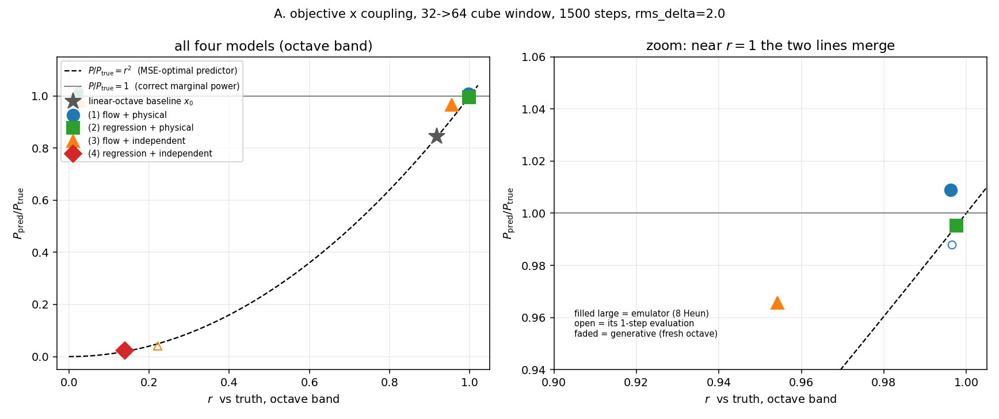
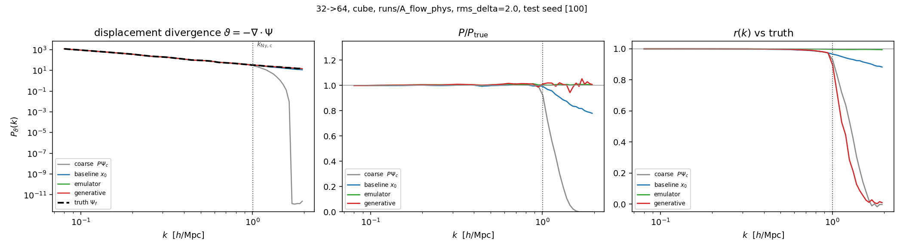
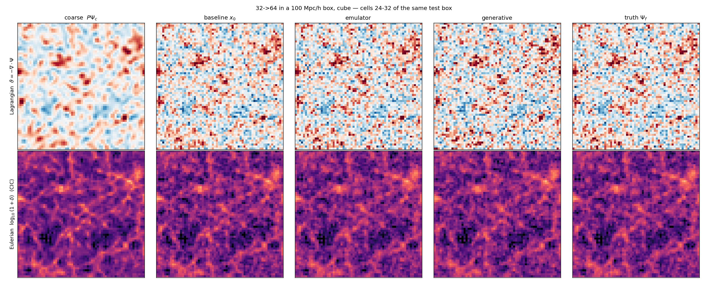

# Stage 3b — experiments following the external review

All on synthetic nested 2LPT, `--nc 32 --nf 64 --box 100 --rms-delta 2.0 --n-index -1.5`,
8 training seeds, test seed 100, `--base 24 --batch 2 --steps 1500`, Adam 3e-4, EMA 0.99,
`--device mps` on an M2 Max (1.82–1.90 s/step, ~47 min per training run). Driver:
`runs/stage3b_driver.sh` (strictly sequential — see the incident note below). Metrics are
octave-band unless marked "coarse". `eps_rel` is the coarse-band `P_eps/P`, i.e. the
consistency of the retained coarse information. No real snapshots were available, so the
real-data parts of D and all of Stage 4 are not done.

---

## A. Objective × coupling (the corrected Section 6.5)

Cube window (the new default). Baseline `x0 = P Psi_c + Psi_lin[eta]` (no network):
`r = 0.9176`, `P/P_true = 0.8446`, `r^2 = 0.8419`, coarse `eps_rel = 1.05e-02`,
rms err `0.187 h_f`.

| model | emu `r` | emu `P/P` | `r^2` | `P/P - r^2` | 1-step `r` | 1-step `P/P` | gen `P/P` | gen `r` | emu `eps_rel` | gen `eps_rel` | rms/`h_f` |
|---|---|---|---|---|---|---|---|---|---|---|---|
| (1) flow + physical | 0.9963 | 1.0090 | 0.9925 | +0.0165 | 0.9965 | 0.9880 | 1.0182 | 0.0249 | 1.32e-03 | 9.32e-03 | 0.055 |
| (2) regression + physical | **0.9976** | 0.9952 | 0.9952 | **−0.0000** | 0.9976 | 0.9952 | 1.0047 | 0.0252 | 6.12e-04 | 8.98e-03 | **0.045** |
| (3) flow + independent | 0.9542 | 0.9656 | 0.9106 | +0.0550 | **0.2212** | **0.0414** | 0.9735 | 0.0305 | 1.16e-02 | 1.10e-02 | 0.146 |
| (4) regression + independent | **0.1399** | **0.0233** | 0.0196 | +0.0037 | 0.1399 | 0.0233 | 0.0233 | 0.1316 | 5.03e-03 | 5.03e-03 | 0.383 |

*Filled large markers: emulator mode, 8 Heun steps. Open markers: the same model evaluated
with one Euler step. Faded markers: generative mode (fresh sampled octave). Dashed line
`P/P = r^2`, solid line `P/P = 1`, star: the linear-octave baseline.*

### Which expectations held

**(2) regression ≥ flow in emulator mode — HELD, and regression wins outright.**
`r` 0.9976 vs 0.9963, rms 0.045 vs 0.055 `h_f`, coarse `eps_rel` 6.12e-04 vs 1.32e-03.
Its generative-mode `P/P` is 1.0047, i.e. ~1 as expected for an accurate deterministic map
applied to a fresh Gaussian octave. This is the same ordering the cloud reference found at
16→32 (regression 0.996/0.990 vs flow 0.993/0.992). Following the working agreement in
CLAUDE.md, this is stated as a fit/optimisation difference between two parameterisations of
the same network and inputs, not as "variance restored": on this smooth 2LPT toy, with the
octave supplied, the direct regressor is the better of the two.

**(3) flow + independent — HELD on all three counts.** Generative `P/P` = 0.9735 ≈ 1;
emulator `r` = 0.9542 sits between the baseline (0.9176) and the physical coupling (0.9963),
i.e. it does *not* ignore the octave, it transports whatever `x_0` contains without having
learned the octave→detail relation; and its one-step evaluation collapses
(`r` = 0.2212, `P/P` = 0.0414, reference 0.38 / 0.045).

**(4) regression + independent — HELD.** Textbook collapse to the conditional mean given the
coarse field: `r` = 0.1399, `P/P` = 0.0233, sitting on `r^2` = 0.0196.

### What deviates

**(2) was expected to be "not on the `r^2` line"; it is on it to four decimals**
(`P/P - r^2` = −0.0000). I believe the expectation is mis-stated rather than the result
anomalous. `P/P = r^2` is the locus of *any* MSE-optimal predictor — it follows from the
residual being uncorrelated with the truth — so being on the line is not a failure mode. The
informative quantity is *where* on the line: (2) sits at `r ≈ 1`, (4) at `r ≈ 0.14`, and the
no-network baseline also sits on it (0.9176, 0.8446 vs `r^2` = 0.8419). The right panel of
the figure shows the consequence: as `r → 1` the lines `P/P = r^2` and `P/P = 1` merge, so
the `r^2` diagnostic has no discriminating power in the high-`r` regime where (1) and (2)
live. The contrast the notes describe is real but only sharp at low `r`, which is exactly
where (4) is.

---

## B. Cube versus sphere window

The octave band is *defined* differently for the two windows (the sphere's includes the
coarse cube corners), so the band-restricted `r` and `P/P` are not strictly comparable
across rows; the total rms error in units of `h_f` is, and so is the coarse-band `eps_rel`
of the generative mode, which is the quantity the theory makes a prediction about.

| run | window | emu `r` | emu `P/P` | emu `eps_rel` | gen `P/P` | **gen `eps_rel`** | **rms/`h_f`** |
|---|---|---|---|---|---|---|---|
| A1 flow + physical | cube | 0.9963 | 1.0090 | 1.32e-03 | 1.0182 | **9.32e-03** | **0.055** |
| B1 flow + physical | sphere | 0.9948 | 1.0341 | 7.95e-03 | 1.0393 | **1.58e-02** | **0.083** |
| A2 regression + physical | cube | 0.9976 | 0.9952 | 6.12e-04 | 1.0047 | **8.98e-03** | **0.045** |
| B2 regression + physical | sphere | 0.9979 | 0.9957 | 1.24e-03 | 0.9944 | **1.76e-02** | **0.047** |

The prediction holds in both pairs: the generative-mode coarse-band consistency is worse for
the sphere, by 1.7× for the flow (1.58e-02 vs 9.32e-03) and 2.0× for the regression
(1.76e-02 vs 8.98e-03). The window-independent rms error also favours the cube, decisively
for the flow (0.055 vs 0.083) and marginally for the regression (0.045 vs 0.047). This is
consistent with the Phase-0 measurement in D, where the cube correction is ~16× smaller than
the sphere one (`rms(eps)/h_c` = 0.0013 vs 0.0215 at 32→64).

**Caveat that limits every `eps_rel` comparison in this report.** `runs/toy32_main`
(sphere, flow, physical, same 1500 steps / base 24 / rms 2.0, but the pre-review script)
gave emu `eps_rel` = 2.55e-03 and rms = 0.059, while B1 — nominally the same configuration
with the current script — gives 7.95e-03 and 0.083. The baselines are identical to four
decimals (`r` 0.9181, `P/P` 0.8465, `eps` 1.050e-02), so the data pipeline is unchanged; the
difference is in the trained model (final loss 4.18e-03 vs 5.69e-03). It is most likely a
different random draw after the script edits, but a single run per configuration cannot
separate that from a real effect. **`eps_rel` therefore carries roughly a factor-3 run-to-run
uncertainty here, and repeat seeds should be the first item of the next round.** The
cube-vs-sphere conclusion survives it — A1's 1.32e-03 is below both sphere values — but no
`eps_rel` ratio below ~3 in this report should be treated as significant.

---

## C. Sampler steps (cube flow model, `runs/A_flow_phys`, no retraining)

| Heun steps | emu `r` | emu `P/P` | emu `eps_rel` | gen `P/P` | gen `eps_rel` | sample-vs-sample coarse `r` |
|---|---|---|---|---|---|---|
| 1 (Euler) | 0.9965 | 0.9880 | 1.58e-03 | 0.9957 | 7.98e-03 | 0.9973 |
| 2 | 0.9970 | 1.0005 | 1.38e-03 | 1.0090 | 8.58e-03 | 0.9967 |
| 4 | 0.9964 | 1.0058 | 1.32e-03 | 1.0148 | 9.07e-03 | 0.9962 |
| 8 | 0.9963 | 1.0090 | 1.32e-03 | 1.0182 | 9.32e-03 | 0.9960 |
| 16 | 0.9962 | 1.0100 | 1.32e-03 | 1.0192 | 9.39e-03 | 0.9959 |

Saturated by N = 2: everything beyond is a drift of <1.2% with no improvement. `r` is flat
to 4 decimals and in fact peaks at N = 2; `P/P` moves monotonically *away* from 1
(0.9880 → 1.0100) as steps are added, so more integration steps make the marginal power
slightly worse, not better, for this model. Note the whole column spans less than the gap to
the independently trained regression baseline (A2), which reinforces the point in A: a
multi-step-vs-one-step comparison *inside* one flow model is not evidence for the flow.

---

## D. How much of the detail is deterministic given the coarse ICs (review point 1)

`python phase0_octaves.py --selftest --selftest-dealias --levels 32 64 128 --offset 0.5 --out runs/D_harm_rms08`
reproduces the cloud reference exactly (operator check 3.6e-07, nestedness 2.8e-07):

| transition | `P_harm/P_d` | `r(d, harm)` | `P_harm/P_nl` | `r(d_nl, harm)` |
|---|---|---|---|---|
| 32→64 | 0.002 | 0.031 | 0.243 | 0.452 |
| 64→128 | 0.005 | 0.061 | 0.237 | 0.446 |

`rms(eps)/h_c` for the three restrictions: sphere 0.0215 / 0.0379, **cube 0.0013 / 0.0037**,
Haar 0.0202 / 0.0337 — the cube correction is ~16× smaller than the sphere's, and the low-`k`
slopes are unchanged (`P_eps` +2.19/+2.18, `P_div` +4.14/+4.18; Haar flat at +0.85/+0.64).

Nonlinearity sweep via a scratchpad snippet (import `phase0_octaves`, `make_selftest`,
`analyse_transition`; no script edited), cube window, de-aliased:

| `rms_delta` | `P_harm/P_d` (32→64 / 64→128) | `P_harm/P_nl` | `r(d_nl, harm)` |
|---|---|---|---|
| 0.8 | 0.0018 / 0.0050 | 0.243 / 0.237 | 0.454 / 0.445 |
| 1.5 | 0.0062 / 0.0167 | 0.243 / 0.237 | 0.454 / 0.445 |
| 2.5 | 0.0165 / 0.0412 | 0.243 / 0.237 | 0.454 / 0.445 |

**This contradicts the expectation that `P_harm/P_nl` grows with nonlinearity: it is exactly
constant.** In pure 2LPT the coarse-only harmonics and the nonlinear part of the detail are
both second order in `delta_lin`, so the amplitude cancels in the ratio. What does grow is
`P_harm/P_d`, as `rms^2` (0.0018 → 0.0062 → 0.0165 tracks `(rms/0.8)^2` = 1 / 3.52 / 9.77 to
within 5%), because `P_d` is dominated by the linear octave. The 24% figure is a structural
constant of the 2LPT toy, not a measurement of how the term behaves in a simulation; the
real-data number needs `--ic` and the correct `--growth` on the 64/128 pair.

---

## Real-space and full-range spectra

Generated by `runs/make_figures.py` (CPU by default, so it can run alongside a training job;
the CIC deposit asserts mass conservation). `P_theta` of the prolonged coarse field falls
~11 decades at `k_Ny,c` = 1.005 h/Mpc — the band the 2× step must fill. The baseline's
octave-band power sinks to 0.78 of truth by `k_Ny,f`; emulator and generative both sit at 1.
`r(k)` is ~1 below `k_Ny,c` for every model, then stays ~1 for the emulator and drops to 0 for
the generative sample: the same realisation versus a different one. The Eulerian row is a
visualisation only — quantitative Eulerian statistics remain on the "deliberately left out"
list in README.md. `fig_spectra_sphere.png` / `fig_slices_sphere.png` are the sphere versions.

---

## Interpretation, tied to the three review points

1. **Regression under full physical conditioning is not power-deficient** — confirmed, and on
   this toy it is the better model: (2) beats (1) on `r`, on rms error and on coarse-band
   consistency, while keeping generative `P/P` ≈ 1. The corrected Section 6.5 is the right
   reading, and the earlier "one step 0.959 vs eight steps 0.993" framing was indeed an
   intra-model comparison with no baseline.
2. **The `r^2` line is a locus of MSE-optimality, not a diagnosis** — (2), (4) and even the
   no-network baseline all sit on it, and it merges with `P/P = 1` as `r → 1`; the meaningful
   statement is the position along the line, which separates (4) at `r = 0.14` from (2) at
   `r = 1.00`.
3. **The coupling is what carries the octave→detail relation, and the flow parameterisation is
   what tolerates a bad coupling** — with the independent coupling the flow degrades
   gracefully (`r` 0.9542, above baseline) while the regression collapses (`r` 0.1399); the
   flow's one-step evaluation collapses too (0.2212), showing that its multi-step integration
   is what rescues it, not extra information.
4. **The cube window is better on every window-independent measure**, and worse for the sphere
   exactly where the theory says it should be — generative-mode coarse-band consistency,
   1.7–2.0× worse — consistent with the ~16× larger correction the sphere needs in D.
5. **Nothing here speaks to the regime that motivates the flow.** 2LPT has no shell crossing,
   the network sees the whole box, and the map is exactly deterministic given `(x_0, C)`; the
   case for the generative objective is multi-stream regions, finite receptive fields and real
   N-body chaos, none of which this toy can probe. The next discriminating experiment needs
   real snapshots — plus repeat seeds, given the factor-3 `eps_rel` scatter documented in B.

## Not done

- Stage 4 and the real-data half of D: no local copies of the 64/128/256/512 snapshots; the
  cluster is still down. `phase0_octaves.py` is ready (`--offset` probe, `--ic`, `--growth`).
- Repeat seeds per configuration — the single largest gap, see the caveat in B.
