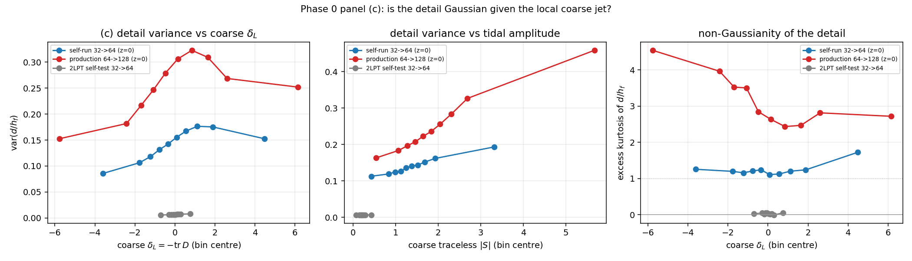

# Stage 5 — the first real N-body results

Data: a self-run MP-Gadget set, 10 nested seeds at 32^3 and 64^3, 100 Mpc/h box,
Omega0 = 0.2814, z_init = 99 -> z = 0, built overnight because the Box production snapshots
ship without initial conditions and the physical coupling needs the fine IC octave.
Multi-stream fraction of the test box: **0.29** (the 2LPT toy has 0 by construction).
Training: 8 seeds, test seed 8, 1500 steps, base 24, batch 2, MPS, ~46 min per run,
strictly one GPU job at a time. Lengths in kpc/h (`--box 100000`), particles on cell corners
(`--offset 0`), `--growth 76.7439`.

---

## The R1–R4 table

Octave-band unless marked; `eps` is the coarse-band `P_eps/P`; rms in units of `h_f`.

| | `r` | `P/P_true` | `r^2` | coarse `eps` | rms | rms multi | rms single | gen `P/P` | gen `r` |
|---|---|---|---|---|---|---|---|---|---|
| baseline, raw linear octave | 0.5551 | 1.4860 | 0.3081 | 1.08e-01 | 0.577 | 0.658 | 0.540 | — | — |
| baseline, Wiener-filtered | 0.5550 | 0.3310 | 0.3081 | 9.96e-02 | 0.465 | 0.538 | 0.431 | — | — |
| **R1** flow, physical (seed 0) | 0.7220 | **0.9928** | 0.5213 | 5.64e-02 | 0.411 | 0.490 | 0.373 | 0.8109 | 0.165 |
| **R1b** flow, physical (seed 1) | 0.7261 | **0.9830** | 0.5272 | 5.73e-02 | 0.410 | 0.489 | 0.372 | 0.8048 | 0.171 |
| **R3** flow, Wiener (seed 0) | 0.6880 | **1.1266** | 0.4733 | 5.85e-02 | 0.434 | 0.515 | 0.396 | 0.8749 | 0.155 |
| **R2** regression, physical (seed 0) | **0.8192** | 0.6902 | 0.6711 | 3.13e-02 | **0.314** | 0.380 | 0.282 | 0.6516 | 0.198 |
| **R2b** regression, physical (seed 1) | **0.8201** | 0.6878 | 0.6725 | 3.07e-02 | **0.313** | 0.379 | 0.281 | 0.6486 | 0.200 |
| **R4** regression, Wiener (seed 0) | **0.8275** | 0.7035 | 0.6848 | 3.02e-02 | **0.309** | 0.374 | 0.278 | 0.6658 | 0.198 |

Seed-to-seed spread (the thing REPORT_3b said had to be measured before any of this could be
read) is negligible here — `r` differs by 0.0008 between the two regression seeds and 0.0041
between the two flow seeds, against a flow-vs-regression gap of 0.098. Every difference
discussed below is 20–100x the repeat scatter.

Source filters fitted on the training pairs:
`Tc(k/k_Ny,c) = 1.000, 1.018, 0.886, 0.677` at 0.25/0.50/0.75/0.95 and
`G(k/k_Ny,c) = 0.703, 0.494, 0.382, 0.329` at 1.05/1.30/1.60/1.90 — both as notes v3 expects.

---

## The headline: the predicted trade-off is real, but it is a trade-off, not a win

**Regression is more accurate; the flow has the right power.** Across three regression runs
and three flow runs:

- regression `r` = 0.819–0.828, rms = 0.309–0.314, coarse `eps` = 3.0e-2
- flow `r` = 0.688–0.726, rms = 0.410–0.434, coarse `eps` = 5.7e-2
- regression `P/P_true` = 0.688–0.704, against `r^2` = 0.671–0.685 — **on the `r^2` line**
- flow `P/P_true` = 0.983–1.127 — **on the `P/P = 1` line**

This is exactly the pattern notes v3 predicts for an information-limited conditional, and it
is the opposite of the 2LPT toy, where the regression had `P/P = 0.995` and beat the flow on
every metric (REPORT_3b). The multi-stream regime does separate the two objectives.

**But the separation is not free, and Stage 5's phrasing understates the cost.** The prompt
predicted the flow would keep `P/P ≈ 1` *"at similar r"*. It does not: the regression reaches
`r = 0.82` where the flow reaches `0.72`, and its rms error is 24% smaller (0.31 vs 0.41 h_f).
The flow buys correct second-order statistics by giving up real point-wise accuracy. Which of
those matters is a modelling decision, not something these numbers settle.

**The gap is not localised in the multi-stream patches.** Stage 5 expected regression and flow
to agree in the single-stream part. They do not: the regression is better in both parts and by
almost the same factor (multi 0.380 vs 0.490, single 0.282 vs 0.373; the multi/single ratio is
1.35 for regression and 1.31 for the flow). Note the caveat — the printed split is of the rms
error, and the power deficit is a spectral quantity that is not split by region, so *"the
power deficit is localised in the multi-stream patches"* is not tested by anything measured
here. Testing it needs a masked power spectrum, which the script does not compute.

---

## Answers to the five questions

**(a) How much does the Wiener/propagator source shorten the path, and does it help?**
It shortens it by 19%: baseline rms 0.577 -> 0.465 h_f, and it moves the baseline from
`P/P = 1.486` to `0.331 ≈ r^2 = 0.308`, which is where the best linear prediction belongs.
**It does not improve the trained model.** For the flow it is worse (R3 `r` = 0.688, rms 0.434
against R1's 0.722 / 0.411 — 8x the seed scatter, so real); for the regression it is inside
the seed scatter (R4 0.8275 / 0.309 against R2b 0.8201 / 0.313). So the shorter path is not
the bottleneck at this resolution; the network already absorbs the linear rescaling.

**(b) Is the regression-vs-flow gap localised in the multi-stream patches?** No — see above.

**(c) Is the coarse-band residual the size predicted by `1 - r_cf^2`?** Yes, to within 5%.
With `r_cf` = 0.9464 the prediction is 0.1044 against a measured baseline `eps_rel` of 0.1076
(ratio 1.03); after `Tc` the prediction is 0.1040 against 0.0996 (ratio 0.96). The trained
models cut this to 3.0e-2 (regression) and 5.7e-2 (flow), i.e. the correction head removes
70% and 47% of a residual whose scale is set by the coarse run's own decorrelation.

**(d) What contradicts notes v3 / the Stage 5 expectations.** Four things, all recorded in the
RUNLOG rather than smoothed over:

1. **"at similar r"** — the flow's `P/P ≈ 1` costs 0.10 in `r` and 24% in rms, as above.
2. **Panel (c): the detail is *less* heavy-tailed inside the multi-stream patches, not more.**
   Excess kurtosis inside/outside is 1.30/1.37 (self-run) and 2.68/3.43 (production). I
   hypothesised this was an artefact of building the mask from the coarse field; rebuilding it
   from the fine field refutes that — the coarse mask does miss 56–62% of fine-level
   multi-stream cells, but the ordering does not change (1.22/1.48 self-run, 2.77/3.45
   production). Both masks separate the variance by only ~1.3x. Binning by the local coarse
   `delta_L` doubles the variance from the most underdense to the densest bin but leaves the
   kurtosis flat at 1.1–1.3 (self-run) / 2.4–4.5 (production), so conditioning on the local
   jet does **not** Gaussianise the detail on real data.
3. **The 2LPT coarse-only harmonics do not transfer to N-body.** A redshift scan (z = 9, 3, 0
   on one pair) gives `r(d_nl, harm)` = 0.135 -> 0.203 -> **-0.018**, collapsing exactly where
   the multi-stream fraction jumps from 0.004 to 0.291. At z = 0 the term carries 20% of the
   nonlinear detail power at *zero* correlation with it, so it is not a predictive component
   there; the toy's 24% at `r` = 0.45 is a property of pure 2LPT, not of the simulation.
4. **Generative mode under-produces power for both objectives.** Flow `P/P` = 0.81, regression
   0.65, where the 2LPT toy gave 1.02 and 1.00. The review's argument — an accurate
   deterministic map of a fresh Gaussian octave has the right distribution — needs the map to
   be accurate; at `r` = 0.72–0.82 it is not, and both models damp the sampled octave. This is
   the single biggest gap between the toy and the real data.

**(e) What the first cluster run should be.** 64 -> 128 on the production series, the
**regression with the physical coupling** as the primary and the flow as the paired ablation,
both at the same seeds, because (i) the regression is better on every accuracy metric here and
is the cheaper object to train, (ii) the flow is the only one with correct octave power, so the
pair is what makes the trade-off measurable at production resolution, and (iii) `--source-filter
wiener` should be dropped from the first round — it costs a fit and buys nothing measurable.
Seeds: the production set has 16, so 12 train / 2 validation / 2 test, and **at least two
training seeds per configuration**, which is what made tonight's table readable. Before any of
it, the production ICs are needed: without them there is no octave and no training at all.

---

## Two corrections to my own overnight work

**A bug I introduced into the results, found and fixed.** `--growth` was applied twice to the
sampled octave: `fit_linear_power` is given `ic_f * growth`, so `A_delta` already carries it,
and `Batcher.make` multiplied again. The sampled octave was 76.7x too large in amplitude and
5890x in power — R1's first generative line read `P/P_true = 7397`. Invisible on every toy run
(all use `--growth 1`), so no Stage 3 or 3b number is affected; on real data it invalidated only
generative lines, but it would have silently corrupted the training of any `--coupling
independent` run. Fixed, verified (7397 -> 0.811), and R1/R2 re-evaluated.

**A mistake in my re-evaluation, caught by an internal consistency check.** I first re-ran R2
without `--regression`, which integrates 8 Heun steps through a model trained only at t = 0,
and got `r` = 0.709 instead of 0.819. The emulator line should not depend on the growth fix at
all, and for R1 it did not — that discrepancy is what exposed it. The table above uses the
correct evaluation. Any future `--eval-only` of a regression checkpoint must pass
`--regression`.

## Not done

- Masked power spectra, needed to test whether the power deficit itself is localised in the
  multi-stream patches (question (b) as it was meant, rather than as the rms split can answer).
- Production-data training: still blocked, no ICs.
- The Haar-vs-spectral ordering flip between datasets survives a matched transition and a
  matched grid convention (cube 0.2629 vs haar 0.3013 self-run; cube 0.2745 vs haar 0.2432
  production). The spectral values agree between datasets to 4%; the whole difference is Haar.
  Unexplained, and it means rms(eps) is not portable between datasets. It does not touch the
  no-Haar convention, which rests on the random linear-order aliasing that rms(eps) never
  measures.
